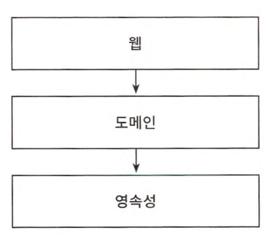
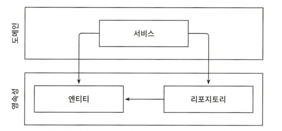

# 1장 계층형 아키텍처의 문제는 무엇일까?

# 계층형 아키텍처

웹(또는 presentation) - 도메인(또는 service, business, application) - 영속성(또는 repository, data)

견고하지만 코드에 나쁜 습관이 스며들기 쉽게 만들고 시간이 지날수록 점점 더 변경하기 어렵게 만드는 수많은 허점을 노출

- 계층형 아키텍처는 DB 주도 설계를 유도
    - DB 구조(영속성 계층) 먼저 생각하고 도메인 로직을 구현
- 의존성 방향은 맞지만 비즈니스 관점에서 부적절
- 원인은 ORM 프레임워크 사용(ORM이 나쁘단 건 아님) -> 영속성 계층에 엔티티를 두게 됨
- 이러면 영속성과 도메인 간에 강결합이 생김

|  |  |
|---------------------|-------------------------|

웹 -> 도메인(서비스) -> 영속성(엔티티, 리포지터리)

- 지름길을 택하기 쉬워짐
  - 상위 계층 컴포넌트를 아래 계층으로 넘겨버리게 됨
  - 규칙을 만들고 규칙이 깨졌을 때 빌드가 실패하도록 만들어야 함
- 테스트 하기 어려워짐
  - 계층을 건너 뛰어서 조작(웹에서 엔티티 조작 등)
  - 도메인 로직을 웹 계층에 구현하게 됨
  - 웹 계층 테스트 시 영속성 계층도 모킹해야 함 -> 단위 테스트 복잡도 증가, 모킹에 시간 소요
- 유스케이스를 숨김
  - 도메인 로직이 여러 계층에 걸쳐 흩어지기 쉬움
  - 여러 개의 유스케이스를 담당하는 아주 넓은 서비스가 만들어지기도 함(도메인 서비스의 '너비'를 강제하지 않아 생기는 문제)
- 동시 작업이 어려워짐
  - 계층형 아키텍처에서는 유스케이스별로 개발자를 나눠 개발하는 것이 불가
  - 코드에 넓은 서비스가 있으면 서로 다른 기능을 동시에 작업하기 더욱 어려움(병합 충돌, 되돌리기 유발)