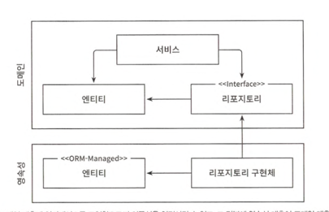

# 2장 의존성 역전하기

## 단일 책임 원칙

- 하나의 컴포넌트는 오로지 한 가지 일만 해야하고, 그것을 올바르게 수행해야 함 -> 실제 의도는 아님
- 실제 정의: 컴포넌트를 변경하는 이유는 오직 하나뿐이어야 함
- 많은 코드들이 SRP 위반하기 때문에 변경이 어려워지고 비용도 증가

## 부수효과에 관한 이야기

- 핵심 특정 컴포넌트 변경으로 인한 부수효과를 우려해서 잘못된 구조를 추가하는 것은 오히려 더 많은 비용 지불하게 됨

## 의존성 역전 원칙

- 코드상의 어떤 의존성이든 그 방향을 역전시킬 수 있다.
  
- 엔티티를 영속성 계층에서 도메인 계층으로 올림
- 도메인 계층에 리포지터리 인터페이스를 만든 다음 실제 리포지터리는 영속성 계층에 구현
- 결과적으로 도메인 계층이 영속성 계층에 의존하던 것이 영속성 계층이 도메인 계층에 의존하게 됨

## 클린 아키텍처

- 동심원 구조(엔티티 - 유스케이스 - 컨트롤러, 게이트웨이, 프레젠터, 웹, UI, 외부 인터페이스, 데이터베이스, 장치)
- 계층 간의 모든 의존성이 안쪽으로 향함
- 코어에는 주변 유스케이스(서비스)에서 접근하는 도메인 엔티티들이 있음
- 유스케이스는 단일 책임을 위해 조금 더 세분화돼 있어 넓은 서비스 문제 회피 가능
- 코어 주변에 다른 모든 컴포넌트들 위치
- 도메인 코드에서는 어떤 영속성 프레임워크나 UI 프레임워크가 사용되는지 알 수 없음
- 따라서, 비즈니스 규칙에 집중 가능 및 도메인 코드를 자유롭게 모델링 가능
- 클린 아키텍처에는 대가가 따름
    - 애플리케이션 엔티티에 대한 모델을 각 계층에서 유지 보수해야 함
    - 각 계층은 엔티티를 새로 만들어야 하고 통신 시에 두 엔티티를 서로 변환해야 함

## 육각형 아키텍처

- 외부 시스템 어댑터와 유스케이스가 포트를 통해 상호작용
- 도메인 엔티티와 유스케이스가 상호작용
- 모든 의존성은 코어를 향하고 있음
- 가장 바깥쪽 계층은 애플리케이션과 다른 시스템 간의 번역을 담당하는 어댑터
- 그 다음으로 포트와 유스케이스 구현체를 결합해서 애플리케이션 계층 구성
- 마지막 계층에 도메인 엔티티 위치

