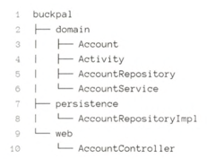
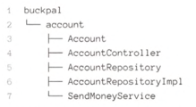
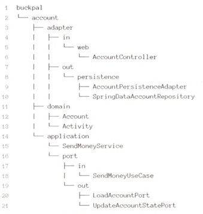
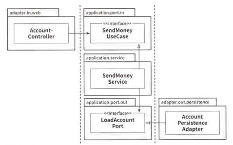

# 3장 코드 구성하기

패키지 구조 중요 -> 실패하면 불러오지 말아야 할 다른 패키지에 있는 클래스들을 불러오게 됨

## 계층으로 구성하기

- 최적 구조가 아님
    - 애플리케이션의 기능 조각이나 특성을 구분짓는 패키지 경계가 없음
    - 애플리케이션이 어떤 유스케이스들을 제공하는지 파악할 수 없음
    - 패키지 구조를 통해 우리가 목표로 하는 아키텍처를 파악할 수 없음

## 기능으로 구성하기

- 외부에서 접근하면 안되는 클래스들에 대해 package-private 접근 수준을 이용해 패키지 간의 경계를 강화할 수 있음
- 클래스명만으로도 유스케이스를 구현한 코드를 찾을 수 있음
- but, 아키텍처의 가시성을 훨씬 더 떨어뜨림
    - 어댑터를 나타내는 패키지명 없음
    - 인커밍 포트, 아웃고잉 포트를 확인할 수 없음
    - 도메인 코드와 영속성 코드 간의 의존성을 역전시킴(도메인 코드가 실수로 영속성 코드에 의존 방지 불가)

## 아키텍처적으로 표현력 있는 패키지 구조

- 이러한 구조를 보고 바로 클라이언트 코드를 찾을 수 있음
- 아키텍처-코드 갭 또는 모델-코드-갭을 효과적으로 다룰 수 있음
- 적어도 어댑터 패키지에 대해서는 모든 클래스들이 application 패키지 내 포트 인터페이스 통하지 않고는 바깥에서 호출 안 됨
- DDD 개념에 직접적으로 대응시킬 수 있음

## 의존성 주입의 역할

- 애플리케이션 계층이 인커밍, 아웃고잉 어댑터에 의존성을 갖지 않는 것

- 모든 계층에 의존성을 가진 중립적인 컴포넌트를 도입
    - SendMoneyUseCase, LoadAccountPort를 인터페이스로 만들고 SendMoneyService를 주입