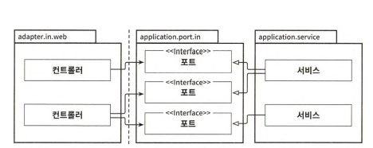

# 5장 웹 어댑터 구현하기

UI나 HTTP API 같이 외부 세계와 시스템 간의 커뮤니케이션을 위한 인터페이스

## 의존성 역전

- 웹 어댑터와 애플리케이션 사이에 포트가 존재하고 이는 의존성 역전 원칙이 적용된 것
- 간접 계층인 포트를 넣는 이유: 외부와 어떤 통신이 일어나고 있는지 정확히 알 수 있음

## 웹 어댑터의 책임

- 웹 어댑터가 하는 일
    - HTTP 요청을 자바 객체로 매핑
        - HTTP 요청 수신, 파라미터와 콘텐츠를 객체로 역직렬화
    - 권한 검사
    - 입력 유효성 검증
    - 입력을 유스케이스의 입력 모델로 매핑
    - 유스케이스 호출
    - 유스케이스 출력을 HTTP로 매핑
    - HTTP 응답을 반환
  
- HTTP와 관련된 것은 애플리케이션 계층으로 침투해서는 안 됨

## 컨트롤러 나누기

- 웹 어댑터는 가능한 좁고 다른 컨트롤러와 가능한 적게 공유하는 조각을 구현해야 함
- 클래스가 작을수록 나중에 찾기 쉬움
- 모든 연산을 하나의 컨트롤러에 넣는 것은 데이터 구조 재사용을 유발함(bad)
- 컨트롤러명과 서비스명에 대해서서도 충분히 의미를 드러내는 이름인지 생각하기
- 이렇게 나누면 서로 다른 연산에 대한 동시 작업이 쉬워짐

