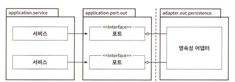
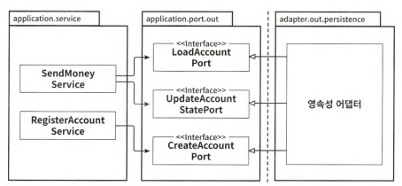
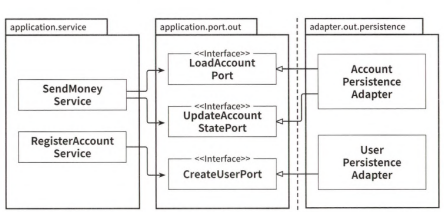

# 6장 영속성 어댑터 구현하기

## 의존성 역전

- 애플리케이션 서비스에서 영속성 기능을 사용하기 위해 포트 인터페이스 호출
- 영속성 계층에 대한 의존성을 없애기 위해 포트라는 간접 계층을 추가함

## 영속성 어댑터의 책임

- 영속성 어댑터가 하는 일
    - 입력 받기
    - 입력을 포맷으로 매핑
    - 입력을 DB로 보내기
    - DB 출력을 애플리케이션 포맷으로 매핑
    - 출력 반환

- 입출력 모델이 영속성 어댑터가 아니라 코어에 위치하는 것을 제외하고 전통적인 영속성과 크게 다르진 않음

## 포트 인터페이스 나누기

- 모든 데이터 베이스 연산을 하나의 리포지터리에 넣기보다 ISP에 따라 특화된 인터페이스로 분리하자
- 넓은 인터페이스는 서비스가 메서드 하나만 사용해도 넓은 의존성을 갖게 되고 불필요한 의존성을 갖게 됨
    - 하나의 기능을 위해 넓은 인터페이스가 필요할까
- 좁은 포트 만들기는 플러그 앤 플레이 경험으로 만듦

## 영속성 어댑터 나누기

- 영속성 어댑터는 영속성 기능을 이용하는 도메인 경계를 따라 여러 개로 나눌 수 있음
- 도메인 코드는 영속성 포트에 의해 정의된 명세를 어떤 클래스가 충족시키는지는 관심 없음

## 스프링 데이터 JPA 예제

- 책 참조

## 데이터 베이스 트랜잭션은 어떻게 해야 할까(트랜잭션 경계의 위치)

- 영속성 어댑터는 어떤 데이터베이스 연산이 같은 유스케이스에 포함되는지 알지 못하기 때문에 언제 트랜잭션을 열고 닫을지 결정할 수 없음
    - 영속성 어댑터 호출을 관장하는 서비스에 위임
- @Transactional이나 AOP 사용

