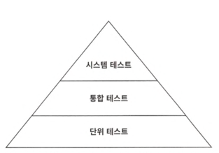

# 7장 아키텍처 요소 테스트하기

## 테스트 피라미드

- 테스트 피라미드: 비용이 적게 드는 테스트를 더 많이 만들어야 함
- 전제: 저비용, 유지보수 용이, 높은 실행 속도, 높은 커버리지
- 단위 테스트: 하나의 클래스를 인스턴스화 하고 해당 클래스의 인터페이스를 통해 기능들을 테스트
    - 만약 테스트 중인 클래스가 다른 클래스에 의존하는 경우 목으로 대체
- 통합 테스트: 연결된 여러 유닛을 인스턴스화하고
    - 시작점이 되는 클래스의 인터페이스로 데이터를 보낸 후
    - 유닛들의 네트워크가 기대한대로 잘 동작하는지 검증
- 시스템 테스트: 애플리케이션을 구성하는 모든 객체 네트워크를 가동시켜 특정 유스케이스가 전 계층에서 잘 동작하는지 검증
- 시스템 테스트 위에는 애플리케이션의 UI를 포함하는 E2E 테스트 층이 있을 수 있음

## 단위 테스트로 도메인 엔티티 테스트하기

- Account 인스턴스화
    - AccountId, Money, ActivityWindow도 생성
- withdraw() 메서드 성공 여부 테스트
- 이해하기 쉽고 빠른 테스트
- 도메인 엔티티에 녹아 있는 비즈니스 규칙을 검증하기에 적절한 방법
- 도메인 엔티티의 행동이 다른 클래스에 거의 의존하지 않기 때문에 <u>다른 종류의 테스트는 불필요</u>

## 단위 테스트로 유스케이스 테스트하기

- BDD에서 일반적으로 사용되는 방식인 given/when/then 섹션으로 나눔
- 테스트 중인 유스케이스 서비스는 상태가 없기 때문에 then 섹션에서 특정 상태를 검증할 수 없고 대신 의존 대상의 특정 메서드와 상호작용 여부를 검증
    - 이는 코드의 행동 변경, 구조 변경에 취약해지는 것
    - 따라서, 모든 동작을 검증하는 대신 중요한 핵심만 골라 집중해서 테스트해야 함
    - 모든 동작을 검증하려고 하면 클래스가 조금이라도 바뀔 때마다 테스트를 변경해야 함-> 테스트 가치 저하

## 통합 테스트로 웹 어댑터 테스트하기

- MockMvc를 통해서 테스트
    - 요청을 보내고 예상한 응답값인지와 상태코드 ok인지 확인 - 표준적인 통합 테스트 방법
    - 모킹한 MockMvc로 테스트(실제 HTTP 아님)
- 단위 테스트가 아니라 통합 테스트인 이유
    - 컨트롤러 클래스만 테스트하는 게 아니라
    - 스프링이 특정 요청 경로, 자바와 JSON 간 매핑, HTTP 입력 검증 등에 필요한 전체 객체 네트워크를 인스턴스화하도록 만듦
    - 테스트에서는 웹 컨트롤러가 이 네트워크의 일부로서 잘 동작하는지 검증
- 웹 컨트롤러가 스프링 프레임워크에 강하게 묶여 있기 때문에 격리된 상태로 테스트하는 것보다 프레임워크와 통합된 상테로 테스트하는 것이 합리적

## 통합 테스트로 영속성 어댑터 테스트하기

- 영속성 어댑터는 어댑터 로직과 데이터베이스 매핑도 검증해야 하기 때문에 통합 테스트 적용이 합리적
- 책의 통합 테스트는 데이테베이스를 모킹하지 않았음
    - 스프링에서는 기본적으로 인메모리 DB에서 테스트하지만 프로덕션 환경에서는 그렇지 않기 때문에 문제가 생길 가능성이 높음
    - 이 때문에 테스트 컨테이너 같은 라이브러리가 아주 유용

## 시스템 테스트로 주요 경로 테스트하기

- 전체 애플리케이션을 띄우고 API를 통해 요청을 보내고, 모든 계층이 조화롭게 잘 동작하는지 검증
- MockMvc가 아니라 TestRestTemplate으로 요청을 보냄(실제 HTTP 통신을 함)
- 실제 출력 어댑터(여기서는 영속성 어댑터만)도 이용
- 시스템 테스트를 통해서 단위 테스트와 통합 테스트가 발견하는 버그와는 또 다른 종류의 버그(계층간 매핑 버그 등)를 발견 및 수정 가능

## 얼마만큼의 테스트가 충분할까

- 라인 커버리지는 테스트 성공 측정하는 데 있어서 잘 못된 지표
- 코드의 중요한 부분이 전혀 커버되지 않을 수 있기 때문에 100% 제외한 어떤 목표도 무의미
    - 100%라 하더라도 버그가 잘 잡혔는지 확신 불가
- 필자는 얼마나 마음 편하게 소프트웨어를 배포할 수 있느냐를 테스트의 성공 기준으로 삼으면 된다고 생각
- 우리가 만들어야 할 테스트 정의
    - 도메인 엔티티를 구현할 때는 단위 테스트로 커버하자
    - 유스케이스를 구현할 때는 단위 테스트로 커버하자
    - 어댑터를 구현할 때는 통합 테스트로 커버하자
    - 사용자가 취할 수 있는 중요 애플리케이션 경로는 시스템 테스트로 커버하자

## 정리

- 육각형 아키텍처는 도메인 로직과 어댑터를 깔끔하게 분리해줌
- 입출력 포트는 테스트에서 뚜렷한 모킹 지점이 됨