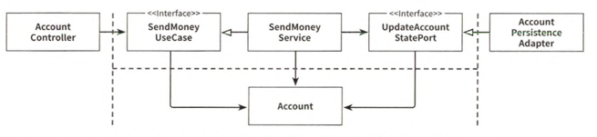
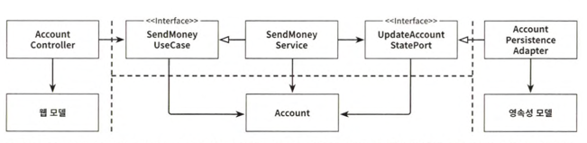
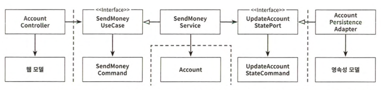
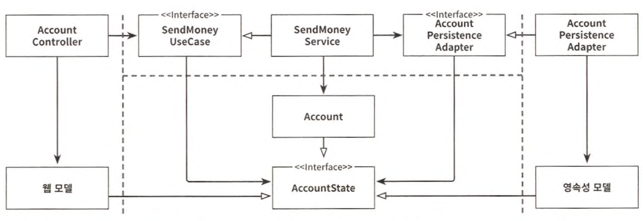

# 8장 경계 간 매핑하기

- 매핑 여부 찬반
    - 찬성: 매핑을 하지 않으면 두 계층간 강결합 발생
    - 반대: 매핑하면 보일러 플레이트 코드를 너무 많이 만들게 됨

## 매핑하지 않기 전략

- 포트 인터페이스가 도메인 모델을 입출력 모델로 사용하면 두 계층간의 매핑을 할 필요가 없음
- 예제에서는 Account 객체가 SendMoneyUseCase(입력), UpdateAccountStatePort(출력) 인터페이스에서 인자로 사용됨
- 이 경우, 웹 계층에서 REST로 모델을 노출시켰다면 모델을 JSON으로 직렬화 하기 위한 애너테이션을 모델 클래스의 특정 필드에 붙여야 할 수도 있음
- 도메인과 애플리케이션 계층은 웹이나 영속성과 관련된 특수한 요구사항에 관심이 없음에도 불구하고 Account 모델 클래스는 이런 모든 요구사항을 다뤄야 함
    - 이는 SRP 위반
- but, 간단한 CRUD 유스케이스의 경우 같은 필드를 가진 웹 모델을 도메인 모델로 혹은 그 반대로 매핑할 필요는 없음
    - 이 때는 매핑하지 않기 전략이 완벽한 선택지
- 어떤 매핑 전략을 선택했떠라도 나중에 언제든 바꿀 수 있음

## '양뱡향' 매핑 전략

- 각 어댑터가 전용 모델을 갖고 있어서 해당 모델을 도매인 모델로, 그리고 그 반대로 매핑할 책임을 가짐
- 각 계층이 전용 모델을 갖고 있어 각 계층이 전용 모델을 변경하더라도 다른 계층에는 영향이 없음
- 이 전략은 웹이나 영속성 관심사로 오염되지 않는 깨끗한 도메인 모델 사용하게 됨.(+ SRP 충족)
- but, 너무 많은 보일러 플레이트 코드가 생김.
    - 코드 양 줄이기 위해 매핑 프레임워크 사용해도 두 모델 간 매핑을 구현하는 데 꽤 시간이 듦
- **어떠한 전략도 철칙처럼 여기면 안 됨**

## '완전'매핑 전략

- 각 연산마다 별도의 입출력 모델 사용(커맨드, 요청 등 단어를 포함한 객체)
- 한 계층을 다른 여러 개의 커맨드로 매핑하는 데 하나의 웹 도메인 모델 간의 매핑보다 더 많은 코드가 필요
- 여러 유스케이스의 요구사항을 함께 다뤄야 하는 매핑에 비해 구현, 유지보수가 훨씬 쉬움
- but, 이 매핑 전략을 전역 패턴으로는 추천하지 않음
    - 이 전략은 웹 계층과 애플리케이션 계층 사이에서 상태 변경 유스케이스의 경계를 명확하게 할 때 가장 빛을 발함
    - 애플리케이션 계층과 영속성 계층 사이에서는 오버헤드 때문에 사용 비추천

## '단방향' 매핑 전략

- 모든 계층의 모델들이 같은 인터페이스를 구현
- 이 인터페이스는 관련 있는 특성에 대한 getter 메서드를 제공해서 도메인 모델의 상태를 캡슐화
- 도메인 모델 자체는 풍부한 행동을 구현할 수 있고 애플리케이션 계층 내의 서비스에서 이러한 행동에 접근 가능
- 매핑 책임이 명확
- but, 매핑이 계층을 넘나들며 퍼져 있기 때문에 이 전략은 다른 전략에 비해 개념적으로 어려움
- 계층 간의 모델이 비슷할 때 가장 효과적

## 언제 어떤 매핑 전략을 사용할 것인가?

- 그때그때 다름
- 한 전략을 코드에 대한 어떤 경우 에도 변하지 않는 전역 규칙으로 정의해서는 안 됨
- 어제는 최선이었던 전략이 오늘은 아닐 수 있음
- 팀 내에서 어떤 전략을 사용할지 결정하기 위한 가이드라인 필요