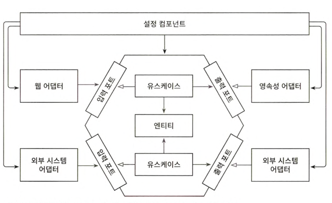

# 9장 애플리케이션 조립하기

유스케이스, 웹 어댑터, 영속성 어댑터 조립하기

## 왜 조립까지 신경써야 할까?

- 코드의 의존성이 올바른 방향을 가리키게 하기 위해서
- 모든 의존성은 안쪽으로 애플리케이션의 도메인 코드 방향으로 향해야 바깥 계층의 변경으로부터 안전
- 이렇게 하면 코드를 훨씬 더 테스트하기 쉬워짐
    - 한 클래스가 필요로 하는 모든 객체를 생성자로 전달할 수 있다면 실제 객체 대신 목으로 전달할 수 있음(단위 테스트 생성 쉬워짐)
- 객체 생성의 책임 -> 설정 컴포넌트
    - 
    - 설정 컴포넌트의 역할
        - 웹 어댑터 인스턴스 생성
        - HTTP 요청이 실제로 웹 어댑터로 전달되도록 보장
        - 유스케이스 인스턴스 생성
        - 웹 어댑터에 유스케이스 인스턴스 제공
        - 영속성 어댑터 인스턴스 생성
        - 유스케이스에 영속성 어댑터 인스턴스 제공
        - 영속성 어댑터가 실제로 데이터베이스에 접근할 수 있도록 보장
    - 이런 설정 컴포넌트는 변경할 이유(책임)이 너무 많음 -> SRP 위반
    - but, 애플리케이션의 나머지 부분을 깔끔하게 유지하기 위해 필요

## 평범한 코드로 조립하기

- main 메서드에서 웹 컨트롤러부터 영속성 어댑터까지 필요한 인스턴스를 생성한 후 함께 연결
- 단점
    - 대형 엔터프라이즈 애플리케이션 실행 시에는 코드가 너무 많이 필요
    - 외부에서 인스턴스를 생성해야 하기 때문에 클래스들이 전부 public이어야 함
        - 스프링은 package-private 의존성을 유지하면서 이러한 작업을 대신해 줄 수 있음

## 스프링 클래스패스 스캐닝으로 조립하기

- 스프링은 클래스 패스에서 접근 가능한 모든 클래스를 확인해서 `@Component` 애너테이션이 붙은 클래스를 찾음
- 클래스패스 스캐닝 방식을 이용하면 아주 편리하게 애플리케이션을 조립할 수 있음
- 스프링이 인식할 수 있는 애너테이션을 직접 만들 수도 있음
- 단점
    - 클래스에 프레임워크에 특화된 애너테이션을 붙여야 하기에 침투적
        - 강경한 클린 아키텍처파들은 반대
    - 스프링 전문가가 아니라면 원인을 찾는데 수일이 걸릴 수 있는 숨겨진 부수 효과를 야기할 수 있음
        - 클래스패스 스캐닝이 애플리케이션 조립에 사용하기에 너무 둔한 방법이기 때문

## 스프링의 자바 컨피그로 조립하기

- 애플리케이션 컨텍스트에 추가할 빈을 생성하는 설정 클래스를 만드는 방식
- `@Configuration` 애너테이션을 통해 클래스 패스스캐닝에서 발견되야 할 클래스 표시(여전히 클래스패스 스캐닝 사용)
    - 모든 빈을 가져오는 대신 설정 클래스만 선택하기 때문에 해로운 효과 발생 확률이 줄어듦
- 클래스패스 스캐닝 방식과 같이 `@Component` 애너테이션을 코드 여기저기에 붙이도록 강제하지 않음
    - 스프링 프레임워크에 대한 의존성 없이 깔끔하게 유지할 수 있음
- 문제점
    - 설정 클래스가 생성하는 빈이 설정 클래스와 같은 패키지에 존재하지 않는다면 이 빈들을 public으로 만들어야 함
