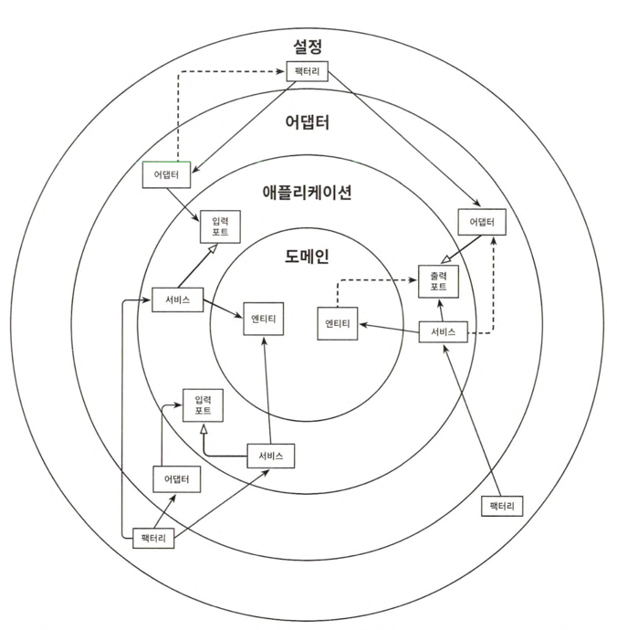
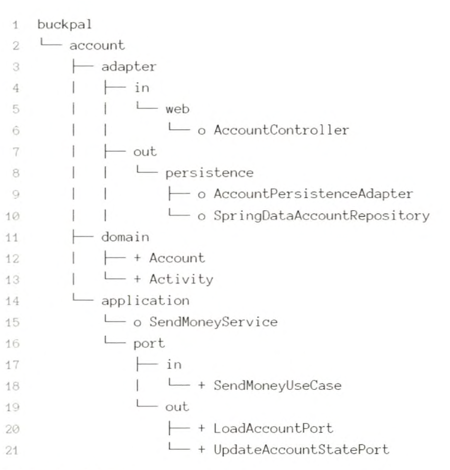

# 10장 아키텍처 경계 강제하기

일정 규모 이상의 프로젝트에서는 시간이 지나면서 아키텍처가 서서히 무너지게 됨 -> 경계 강제 필요성

## 경계와 의존성

- 흩어져 있는 육각형 아키텍처 모습들. 허용되지 않은 의존성(점선 화살표)이 생기기도 함

## 접근 제한자

- 자바의 접근 제한자: public protected, private, package-private(default)
- package-private의 중요성: 자바 패키지를 통해 클래스들을 응집적인 모듈로 만들어 줌
    - 모듈 내에 있는 클래스들은 서로 접근 가능하지만, 패키지 바깥에서는 접근할 수 없음
    - 모듈의 진입점으로 활용될 클래스들만 public으로 만들면 됨(엔트리 포인트)
    - 이렇게 하면 의존성이 잘못된 방향을 가리켜서 의존성 규칙을 위반할 위험이 줄어듦
    - 이 방법을 스프링에서 쓰려면 9장에서 설명한 클래스패스 스캐닝을 이용해야 함

- 도메인 계층, 그리고 application 계층의 port는 다른 계층에서 접근 가능해야 하므로 package-private
- package-private 제한자는 하나의 패키지에 클래스가 몇 개 안 되는 작은 모듈에서 가장 효과적

## 컴파일 후 체크

- public 제한자 쓰는 경우 의존성 규칙 위반을 확인할 다른 방법 -> 컴파일 후 체크
- 이런 런타임 체크는 지속적인 통합 빌드 환경에서 자동화된 테스트 과정에서 가장 잘 동작
- 자바용 도구 ArchUnit 이용
- 잘못된 의존성을 바로 잡는데 컴파일 후 체크가 큰 도움이 되지만, 실패에 안전하지 않음
- 패키지명 잘못되면 테스트가 어떤 클래스도 찾지 못하기 때문에 위반 사례 발견 못 함
- 컴파일 후 체크는 언제나 코드와 함께 유지보수 필요

## 빌드 아티팩트

- 메이븐이나 그레이들 같은 빌드 도구의 주요 기능 -> 의존성 해결
    - 코드베이스를 빌드하기 위해 그것들이 의존하고 있는 모든 아티팩트가 사용 가능한지 확인해줌
    - 이를 활용해서 모듈과 아키텍처 계층 간의 의존성을 강제할 수 있음
    - 각 모듈 혹은 계층에 대해 전용 코드베이스와 빌드 아티팩트로 분리된 빌드 모듈(JAR 파일)을 만들 수 있음
    - 빌드 모듈로 아키텍처 경계를 구분하는 것의 장점
        - 빌드 도구가 순환 의존성을 허용하지 않으므로 빌드 모듈 간 순환 의존성이 없음을 확신할 수 있음
        - 빌드 모듈 방식에서는 다른 모듈을 고려하지 않고 특정 모듈의 코드를 격리한 채로 변경할 수 있음
        - 모듈간 의존성이 빌드 스크립트에 분명하게 선언돼 있기 때문에 새로 의존성을 추가하는 일은 우연이 아닌 의식적인 행동이 됨