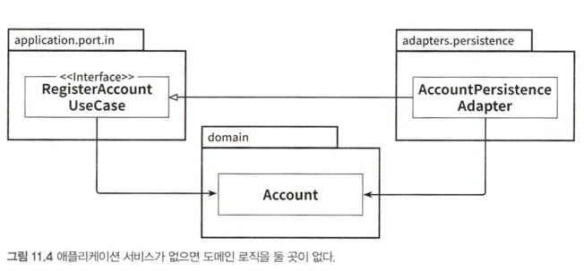

# 11장 의식적으로 지름길 사용하기

지름길을 막으려면 지름길을 알아야

## 왜 지름길은 깨진 창문 같을까

- 깨진 유리창 이론이 코드 작업에 적용될 때의 의미
    - 품질이 떨어진 코드에서 작업할 때 더 낮은 품질의 코드를 추가하기가 쉽다.
    - 코딩 규칙을 많이 어긴 코드에서 작업할 때 또 다른 규칙을 어기기도 쉽다.
    - 지름길을 많이 사용한 코드에서 작업할 때 또 다른 지름길을 추가하기도 쉽다.

## 깨끗한 상태로 시작할 책임

```text
코드를 짜는 것은 차를 도둑질하는 것과는 다르지만, 우리는 모두 깨진 창문 심리에 무의식적으로 영향을 받는다.
그래서 가능한 한 지름길을 거의 쓰지 않고 기술 부채를 지지않은 채로 프로젝트를 깨끗하게 시작하는 것이 중요하다.
```

- 그러나 지름길을 취하는 것이 실용적일 때도 있음(프로젝트 전체로 봤을 때 중요하지 않은 부분 작업, 프로토타입 작업, 경제적인 이유)

## 유스케이스 간 모델 공유하기

- 유스케이스 간 입출력 모델을 공유하는 것은 유스케이스들이 기능적으로 묶여있을 때 유효
    - 특정 요구사항을 공유할 때 괜찮다는 의미
- 두 유스케이스가 서로 간에 미치는 영향 없이 독립적으로 진화해야 한다면 입출력 모델을 공유하는 방식은 '지름길'이 됨
    - 유스케이스를 독립적으로 진화할 필요가 있는지 질문 필요(답이 '예'이면 모델 분리 필요)

## 도메인 엔티티를 입출력 모델로 사용하기

- 간단한 생성이나 업데이트 유스케이스에서는 유스케이스 인터페이스에 도메인 엔티티가 있는 것이 괜찮을지 모르지만
- 더 복잡한 도메인 로직을 구현해야 한다면 유스케이스 인터페이스에 대한 전용 입출력 모델을 만들어야 함
    - 유스케이스의 변경이 도메인 엔티티까지 전파되지 않기 위함

## 인커밍 포트 건너뛰기

- 아웃고잉 포트와 다르게 인커밍 포트는 의존석 역전에 필수적인 요소는 아님
- but, 인커밍 포트를 제거하면 유스케이스를 구현하기 위해 어떤 서비스 메서드를 호출해야 할지 알아내기 위해 애플리케이션의 내부 동작에 대해 더 잘 알아야 함
- 인커밍 포트를 유지해야 하는 또다른 이유는 아키텍처를 쉽게 강제할 수 있기 때문
- 애플리케이션 규모가 작거나 인커밍 어댑터가 하나밖에 없다면 인커밍 포트가 없는 것이 편함
    - 그러나 앞으로도 애플리케이션 규모가 작게 유지되거나 어댑터가 하나밖에 없을 것이라고 확신 불가

## 애플리케이션 서비스 건너뛰기



- 간단한 CRUD 유스케이스에서 구미가 당기는 방법
- but, 인커밍 어댑터와 아웃고잉 어댑터 사이에 모델을 공유해야 함
- 나아가 애플리케이션 코어에 유스케이스라고 할 만한 것이 없어짐
    - 시간이 지나면 아웃고잉 어댑터에 도메인 로직 추가하게 되고, 이러면 도메인 로직이 흩어져서 도메인 로직을 찾거나 유지보수하기가 어려워짐
    - 간단한 CRUD 케이스에서는 애플리케이션 서비스를 건너뛰기로 결정할 수 있지만,
    - 유스케이스가 CRUD보다 더 많은 일 하게되면 애플리케이션 서비스 만든다는 명확한 가이드라인 필요  
